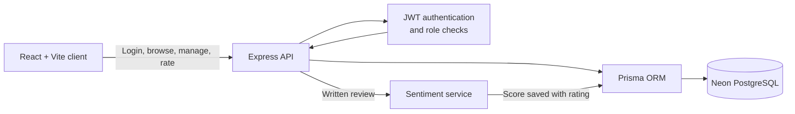

# StorePulse

[](https://react.dev/)
[](https://www.typescriptlang.org/)
[](https://expressjs.com/)
[](https://www.prisma.io/)
[](https://www.postgresql.org/)
[](https://neon.com/)

StorePulse is a role-based store rating platform built for the FullStack Intern Coding Challenge. It gives customers a simple way to rate stores, gives owners a focused view of customer feedback, and gives administrators a single place to manage the platform.

## Highlights

- One login flow with protected views for Administrators, Members, and Store Owners
- Public member registration with server-side validation
- Store discovery, search, and one rating per member per store, with later updates supported
- Administrator dashboard for user, store, and rating totals
- Administrator flow to create a store and its linked Store Owner account together
- Store Owner dashboard with average rating, customer feedback, and sentiment labels
- Sentiment analysis for written reviews, presented as **Happy**, **Neutral**, **Unhappy**, or **No comment**

## Product walkthrough

See the [UI walkthrough](https://github.com/Vedika-Sd/storepulse-role-based-rating-platform/blob/main/UI_walkthrough.md) for screen-by-screen features and screenshots.

## Tech stack

| Area | Technology |
| --- | --- |
| Frontend | React, TypeScript, Vite, React Router |
| Backend | Node.js, Express, TypeScript |
| Database | PostgreSQL on Neon |
| ORM | Prisma |
| Authentication | JWT and bcrypt password hashing |
| Validation | Zod |
| Review analysis | `sentiment` package |

Neon provides the hosted PostgreSQL database used by Prisma. This keeps the application database separate from the local development environment and supports quick, reliable data retrieval.

## Architecture and workflow



1. A user signs in once and receives a JWT containing their role.
2. Protected frontend routes and backend middleware allow access only to that role's actions.
3. Administrators create stores together with their Store Owner account in one database transaction.
4. Members submit or update a 1 to 5 star rating and optional review.
5. The backend calculates and stores sentiment for written feedback.
6. Store Owners see ratings for their own store and a plain-language sentiment label for each review.

## Roles and workflow

| Role | What they can do |
| --- | --- |
| Administrator | View platform totals, create member/admin accounts, create stores with assigned owners, and browse users and stores. |
| Member | Create an account, browse/search stores, submit or update a 1 to 5 star rating with an optional review, and update their password. |
| Store Owner | View their own store’s average rating, submitted feedback, and the sentiment of written reviews. |

For data consistency, a Store Owner is created together with their store. The backend creates both records in one database transaction and connects them through `Store.ownerId`.

## Sentiment integration

When a member saves a written review, the backend evaluates it with the `sentiment` package and stores a normalized sentiment score alongside the rating. The Store Owner dashboard converts that score into plain language:

- **Happy** for positive feedback
- **Neutral** for mixed or balanced feedback
- **Unhappy** for negative feedback
- **No comment** when no written review was submitted

This keeps the insight understandable for store owners while preserving the score for the application’s data layer.

## Demo administrator

Use this account to access the administrator area and manage users, stores, and ownership assignments:

```text
Email: test@demo.com
Password: Testdemo@123
```

## Local setup

### 1. Configure the backend

Create `backend/.env` with your Neon PostgreSQL URL and JWT secret:

```env
DATABASE_URL="your-neon-postgresql-connection-string"
JWT_SECRET="your-strong-jwt-secret"
PORT=5000
```

Install dependencies, generate Prisma Client, apply the schema, and start the API:

```powershell
cd backend
npm.cmd install
npx.cmd prisma generate
npx.cmd prisma db push
npm.cmd run dev
```

The API runs at `http://localhost:5000`.

### 2. Configure and start the frontend

Create `frontend/.env` from `frontend/.env.example` if the API is not running on the default address:

```env
VITE_API_URL=http://localhost:5000/api
```

Then run:

```powershell
cd frontend
npm.cmd install
npm.cmd run dev
```

Open `http://localhost:5173` in your browser.

## Project structure

```text
backend/
  prisma/              Prisma schema for users, stores, and ratings
  src/controllers/     API request handling
  src/middleware/      JWT authentication, roles, and validation
  src/services/        Sentiment analysis
  src/validators/      Zod request schemas

frontend/
  src/api/             Authenticated API client
  src/components/      Shared layout and rating components
  src/context/         Authentication state
  src/pages/           Role-specific screens
  src/routes/          Protected route handling
```
